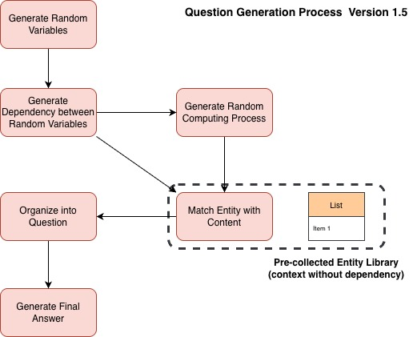
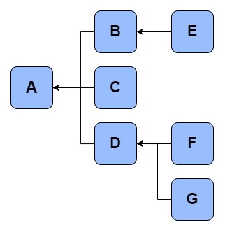
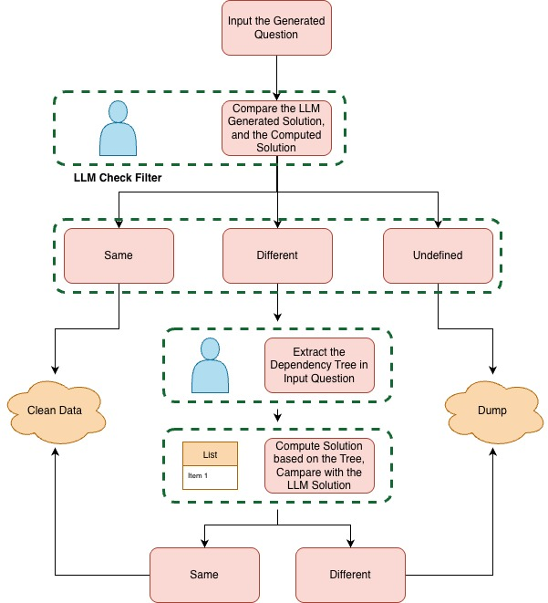

# Math Word Problem Generator

A systematic framework for generating high-quality math word problems with controllable complexity and logical coherence.

## Overview

This project addresses the challenge of creating large-scale, high-quality mathematical reasoning datasets for training language models. Unlike existing approaches that rely heavily on variants of GSM8K, this framework generates diverse, logically consistent math word problems from fundamental mathematical operations.

**Patent No**: CN20688502A

## Key Features

- **Dependency-Based Generation**: Problems are built on tree-structured variable dependencies, ensuring logical coherence
- **Controllable Complexity**: Adjustable tree depth and width to control problem difficulty
- **High Utilization Rate**: ~70-75% of generated problems are valid and usable
- **Diverse Scenarios**: 500+ unique problem themes covering real-world contexts
- **Automatic Validation**: Built-in answer verification and error correction pipeline

## Motivation

Existing math problem generation methods (e.g., GSM8K variants) suffer from:
- High scenario repetition rates (~70% concentrated in 3 story types)
- Disconnected solution steps with meaningless intermediate calculations
- Unrealistic conditions (e.g., fractional people, impossible quantities)

This framework overcomes these limitations through structured dependency modeling.

## Architecture

### Version 1.0 Pipeline

```
1. Random Variable Generation → 
2. Dependency Relationship Construction → 
3. Mathematical Operation Assignment → 
4. Theme Selection → 
5. Background Story & Entity Definition → 
6. Problem Generation → 
7. Answer Validation & Correction
```



#### Core Components

**1. Variable Dependency Tree**
- Tree-structured relationships (no cycles)
- Example: `A depends on B, C, D` → `B depends on E` → `D depends on F, G`
- Ensures optimal solution paths



**2. Entity Library (V1.5)**
- Pre-built entity databases organized by themes
- Multiple questioning perspectives for each entity set
- Example: For "Snacks" theme, query price, demand, calories, popularity, etc.

**3. Answer Generation & Validation**
- Automated problem solvability classification
- Cross-verification with model-generated solutions
- Hierarchical dependency mapping for complex problems
- ~60% problems have correct answers on first generation
- ~40% of error cases successfully corrected through re-solving



## Data Statistics

Sample datasets with varying complexity:

| Dataset | Max Depth | Max Width | Correct/Error/Unsolvable/Total | 
|---------|-----------|-----------|--------------------------------|
| 2w_10_3_7 | 7 | 3 | 3002/1550/402/5000 |
| 2w_10_3_9 | ≤9 | ≤3 | 1355/409/135/2000 |
| 2w_10_9_9 | ≤9 | ≤9 | 3650/1044/312/5000 |
| 2w5_11_3_9 | ≤9 | ≤3 | 30294/11774/6742/50000 |

## Example Problem

**Generated Problem:**

At an elementary school, students are working on a large collaborative project involving six teams: Art, Science, Math, History, Physical Education, and Music. Each team is responsible for completing specific tasks to advance the overall project. The principal wants to track both individual team progress and the project's total progress. The Art, Science, and Math teams have made significant contributions, while the History and PE teams are also working hard. The principal has set a goal for the total number of tasks to be completed and wants to understand the current status. Here's what we know:

The Science team has completed 10 experiments. The PE team's progress equals 6 tasks. The Math team has completed 12 tasks. The Music team's progress equals 14 tasks. The History team has completed 3 tasks. The principal set an initial task count of 10. The combined progress of the Math and History teams is 9 tasks.

The principal also knows the following:

The total completed tasks exceed the initial task count by 19. The remaining tasks are 21 fewer than the total completed tasks. Half of the remaining tasks contributes to the total progress calculation. The Art team's progress equals the sum of the combined progress from Science, Math, and History teams, plus the PE team's progress. The difference between the Math and History teams' progress equals the difference between their combined progress and the History team's progress alone. The school project's total progress is the sum of half the remaining tasks, the Art team's progress, and the Music team's progress.
Can you calculate the total progress of the school project?

## Training Results

Model performance on generated datasets:

| Model | Training Data | Test Set | Accuracy |
|-------|---------------|----------|----------|
| tianji-2b-v9-dpo (baseline) | None | op10 | 35.49% |
| tianji-2b-v9-base | op10+op20 (107K) | op10 | 80.68% |
| tianji-2b-v9-base | op10+op20 (107K) | op20 | 69.67% |
| tianji-2b-v9-base | op10+op20 (107K) | op10+op20 | 79.19% |
| qwen2.5-7b-math | - | - | 70.00% |

Train model performance on public math benchmarks:
**Benchmark Results:**

| Benchmark | tianji-2b-v9-dpo (Baseline) | tianji-2b-v9-base (Trained) | Absolute Improvement | Relative Improvement |
|-----------|----------------------------|----------------------------|---------------------|---------------------|
| **GSM8K** | 35.0% | **51.0%** | +16.0% | +45.4% |
| **MATH** | 12.5% | **23.8%** | +11.3% | +90.4% |
| **MathQA** | 28.3% | **41.7%** | +13.4% | +47.3% |
| **SVAMP** | 42.1% | **54.9%** | +14.8% | +35.2% |
| **ASDiv** | 38.6% | **54.2%** | +14.6% | +40.4% |

**Comparison with Baseline Models:**

| Model | Parameters | GSM8K | MATH | Training Data Source |
|-------|-----------|-------|------|---------------------|
| Qwen2.5-Math-1.5B | 1.5B | 51.5% | 22.1% | Traditional + Augmented |
| **tianji-2b-v9-base** | **2B** | **53.0%** | **23.8%** | **Our Pipeline** |
| Qwen2.5-Math-7B | 7B | 83.6% | 58.3% | Traditional + Augmented |
| Qwen2.5-3B-Instruct | 3B | 58.4% | 25.2% | General Training |

## Limitations & Future Work

**Current Limitations:**
- Entity definition quality degrades with >10 variables
- Difficulty handling complex subtraction/division dependencies
- Model struggles with highly complex dependency chains

**V2.0 Roadmap:**
- Enhanced entity library with hierarchical structural relationships
- Natural language logic constraints (e.g., implicit distance = speed × time)
- Elimination of redundant common-sense calculation steps
- Improved coherence for multi-level entity relationships

## References

- **Physics 2.1**: [arXiv:2407.20311](https://arxiv.org/pdf/2407.20311)
- **ControlMath**: [arXiv:2409.15376](https://arxiv.org/abs/2409.15376)

## License


